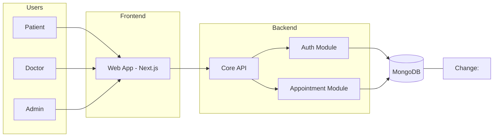

# 🩺 OlaDoc – Healthcare Appointment & Telemedicine Platform

OlaDoc is a modern healthcare platform that connects patients with doctors for appointments, secure document sharing, chat, video consultations, and online payments.
Built with Next.js, Prisma, MongoDB, and trusted external providers, OlaDoc offers a seamless telemedicine experience.

## 🧪 MVP Architecture (Minimum Viable Product)

### MVP Goal
The MVP focuses strictly on validating the core value proposition of OlaDoc:
patients can search for doctors, book appointments, and doctors can manage their availability.

Advanced features are intentionally excluded to reduce complexity and validate real user demand.

### MVP Scope

**Included**
- Patient, Doctor, Admin access
- Authentication and role-based access
- Appointment booking
- Doctor availability management
- Central database

**Excluded**
- Payments
- Video consultations
- Chat
- Notifications
- File uploads
- Background workers

### MVP Architecture Diagram

## 🗺️ System Architecture — Phase I (Production Release)

```mermaid
flowchart LR

%% ============================
%%         USERS
%% ============================
subgraph USERS["Users"]
    direction TB
    PAT[Patient]:::user
    DOC[Doctor]:::user
    ADM[Admin]:::user
end

%% ============================
%%         FRONTENDS
%% ============================
subgraph FRONTENDS["Frontend"]
    direction TB
    FE_PAT[Patient App - Nextjs]:::frontend
    FE_DOC[Doctor Dashboard - Nextjs]:::frontend
    FE_ADM[Admin Panel - Nextjs]:::frontend
end

%% ============================
%%      EXTERNAL PROVIDERS
%% ============================
subgraph EXTERNAL["Providers"]
    direction TB
    AUTHP[Auth Provider - OAuth OIDC]:::external
    VIDEOP[Video Provider - WebRTC SDK]:::external
    PAYP[Payment Provider - Checkout Webhooks]:::external
    EMAILP[Email SMS Provider]:::external
    FILEP[File Storage Provider]:::external
end

%% ============================
%%      INTERNAL SYSTEM
%% ============================
subgraph INTERNAL["System"]
    direction LR

    APIGW[API Gateway - REST API ]:::gateway

    %% SERVICES
    ACC_SVC[Accounts Service]:::service
    APPT_SVC[Appointments Service]:::service
    DOCS_SVC[Documents Service]:::service
    CHAT_SVC[Chat Service]:::service
    VIDEO_SVC[Video Chat Service]:::service
    PAY_SVC[Payment Service]:::service

    %% DATABASES
    DB_MAIN[(MongoDB)]:::database
    DB_DOCS[(Documents Index DB - UploadThing)]:::database
    DB_CHAT[(Chat Messages DB - Firebase)]:::database

    %% QUEUE + WORKERS
    QUEUE{{Event Queue}}:::queue
    WORKERS[Background Workers - Reminders Notifications]:::service
end

%% ============================
%%         USER FLOWS
%% ============================
PAT -->|HTTPS| FE_PAT
DOC -->|HTTPS| FE_DOC
ADM -->|HTTPS| FE_ADM

FE_PAT -->|REST| APIGW
FE_DOC -->|REST| APIGW
FE_ADM -->|REST| APIGW

%% ============================
%%     AUTHENTICATION
%% ============================
FE_PAT -->|OAuth Login| AUTHP
FE_DOC -->|OAuth Login| AUTHP
FE_ADM -->|OAuth Login| AUTHP
APIGW -->|Token Validation| AUTHP

%% ============================
%%      VIDEO CALL FLOWS
%% ============================
FE_PAT <--> |WebRTC| VIDEOP
FE_DOC <--> |WebRTC| VIDEOP

%% ============================
%%      PAYMENT FLOWS
%% ============================
FE_PAT -->|Checkout| PAYP
PAYP -->|Webhook| APIGW

%% ============================
%%   API TO INTERNAL SERVICES
%% ============================
APIGW --> ACC_SVC
APIGW --> APPT_SVC
APIGW --> DOCS_SVC
APIGW --> CHAT_SVC
APIGW --> VIDEO_SVC
APIGW --> PAY_SVC

%% ============================
%%     DATABASE CONNECTIONS
%% ============================
ACC_SVC --> DB_MAIN
APPT_SVC --> DB_MAIN
DOCS_SVC --> DB_DOCS
CHAT_SVC --> DB_CHAT

%% ============================
%%     ASYNC EVENT FLOWS
%% ============================
APPT_SVC -->|Event| QUEUE
PAY_SVC -->|Event| QUEUE
DOCS_SVC -->|Event| QUEUE

QUEUE --> WORKERS
WORKERS -->|Email SMS| EMAILP

%% ============================
%%     FILE UPLOAD FLOWS
%% ============================
FE_PAT -->|Upload File| FILEP
DOCS_SVC -->|Store File Metadata| DB_DOCS

%% ============================
%%        STYLE DEFINITIONS
%% ============================
classDef user fill:#ffe6e6,stroke:#cc0000,stroke-width:1px,color:#000;
classDef frontend fill:#e6f2ff,stroke:#0073e6,stroke-width:1px,color:#000;
classDef external fill:#fff2cc,stroke:#cc9900,stroke-width:1px,color:#000;
classDef gateway fill:#e8e8e8,stroke:#666,stroke-width:1px,color:#000;
classDef service fill:#eafbe7,stroke:#2d8a34,stroke-width:1px,color:#000;
classDef database fill:#fde2e4,stroke:#c9184a,stroke-width:1px,color:#000;
classDef queue fill:#f0e6ff,stroke:#7b2cbf,stroke-width:1px,color:#000;

%% ============================
%%        LEGEND
%% ============================
subgraph LEGEND["Legend"]
    direction TB
    L1[Red Oval = User]
    L2[Blue Box = Frontend]
    L3[Green Box = Internal Service]
    L4[Yellow Box = External Provider]
    L5[Pink Cylinder = Database]
    L6[Purple Diamond = Event Queue]
    L7[Arrows show REST OAuth WebRTC Webhooks]
end
```

## 📈 Phase II — Scalability & Optimization

### Phase II Goal
Phase II focuses on improving scalability, performance, and reliability
once the platform experiences real user growth.

### Planned Changes
- Split modular monolith into independent microservices
- Introduce Redis caching for appointment availability
- Add message broker (RabbitMQ / Kafka)
- Implement rate limiting and API throttling
- Improve audit logging and regulatory compliance
- Enable horizontal scaling and multi-region deployment

### Implementation Order Strategy
Implementation order is decided based on:
- User behavior and feature adoption
- System performance bottlenecks
- Operational cost versus delivered value

Examples:
- High booking traffic → caching first
- Notification delays → async queues
- Video load issues → dedicated media services

## 🚀 Features

### For Patients
- Search doctors by specialty, location, or availability
- Book, cancel, and manage appointments
- Securely upload medical documents
- Real-time chat with doctors
- Video consultations via provider SDK
- Online payments

### For Doctors
- Dashboard with full appointment calendar
- Manage patient interactions
- Access and download patient documents
- Chat and video consultations

### For Admins
- Manage users, doctors, and clinics
- Verify doctors
- System analytics and admin settings

---

## 🧩 System Elements

### Frontends
- Patient Web App (Next.js)
- Doctor Dashboard (Next.js)
- Admin Panel (Next.js)

### Backends
- Core API (Next.js API Routes / Server Actions)
- Background workers (notifications, reminders)

### Data & Storage
- MongoDB + Prisma ORM
- External cloud storage for files
- Optional Redis

### External Providers
- Authentication provider (OAuth/OIDC)
- Video call provider (WebRTC SDK)
- Payment provider
- Email/SMS provider

---

## 🏗 Architectural Patterns Applied

- Modular Monolith inside Next.js for simplicity and maintainability
- Event-driven async patterns for reminders, notifications, and payment webhooks
- Real-time communication (via provider SDK) for chat & presence
- Externalized services for auth, video calls, and payments
- Edge-layer middleware (Vercel) for rate limiting and token validation

---

## 🔌 Communication Between Components

| From                       | To                    | Method                               |
|----------------------------|------------------------|----------------------------------------|
| Frontend → Core API        | Core API               | HTTPS (REST)                           |
| Core API → Database        | MongoDB (Prisma ORM)   | TCP (via Prisma client)                |
| Frontend → Auth Provider   | Auth Provider          | OAuth / OIDC                           |
| Frontend ↔ Video Provider  | Video Provider         | WebRTC + Provider SDK                  |
| Frontend → Payment Provider| Payment Provider       | Checkout Redirect / Payment Widget     |
| Payment Provider → API     | Core API               | Webhooks (Payment success/failure)     |
| API → Email/SMS Provider   | Email/SMS Provider     | HTTPS                                   |
| API → Workers              | Background Workers     | Internal Async Queue / Event Trigger    |

---

## 🔐 Authentication & Authorization

### Authentication (AuthN)
Handled entirely by the external authentication provider:
- User login & identity
- Token issuance
- Session management
The API trusts validated tokens.

### Authorization (AuthZ)
Role-based permissions inside the API.

**Roles**
- PATIENT
- DOCTOR
- ADMIN

**Controls**
- appointments
- medical documents
- dashboards
- prescriptions
- payments
- admin features

---

## 🗄 Tech Stack

- Next.js 14
- React + TailwindCSS
- Prisma ORM
- MongoDB
- External Auth / Video / Payment / Email services
- Vercel Deployment + GitHub CI/CD

## 🔮 Future Phases & Roadmap

The following features are postponed until clear user demand
or business justification exists.

### Potential Enhancements
- Mobile applications (iOS / Android)
- AI-based doctor recommendations
- Appointment no-show prediction
- Advanced analytics dashboards
- Insurance and billing integration
- Electronic prescriptions
- Multi-country deployment

These features will be implemented only when
their business value justifies the added complexity.

