# 🩺 E-Healthcare Appointment & Telemedicine Platform

This project is a distributed e-healthcare system designed to manage appointments, schedules, consultations, communication, and administrative operations between patients, healthcare providers, and healthcare centers.

The system is built using a **microservices architecture** and supports **multiple frontends (web, mobile, desktop)** communicating through well-defined APIs, following the principles taught in **FE405 – Designing Apps and APIs**.

---

## 1️⃣ Project Elements

### Users
- **Patient**
  - Book and manage appointments
  - Access medical records and documents
  - Communicate with healthcare providers
  - Receive notifications
  - Participate in virtual consultations
  - Submit reviews
  - Manage personal account

- **Healthcare Provider**
  - Manage availability and schedules
  - Confirm or reject appointments
  - Conduct consultations
  - Access patient history
  - Communicate with patients

- **Healthcare Center**
  - Manage multiple healthcare providers
  - Coordinate schedules and appointments
  - Invite providers to join the center
  - Manage center-wide operations
  - View aggregated statistics

- **Administrator**
  - Manage user accounts and roles
  - Moderate reviews
  - Access system-wide analytics

---

## Frontend Applications

- 📱 Patient Mobile Application  
- 🌐 Patient Web Application  
- 🌐 Healthcare Provider Web Application  
- 🖥️ Healthcare Center Desktop Application  
- 🌐 Admin Dashboard  

All frontends are client-facing applications and interact with the system exclusively through APIs.

---

## Backend Microservices

- API Gateway  
- Auth Service  
- Appointment Service  
- Schedule Service  
- Patient Service  
- Consultation Service  
- Document Service  
- Communication Service  
- Notification Service  
- Review & Rating Service  
- Stats & Analytics Service  

Each service is independently deployable and owns its own data.

---

## Data Stores

- Relational databases (users, appointments, schedules, consultations)
- Object storage (medical documents)
- Key-value store (cache, sessions)

---

## 2️⃣ Architectural Patterns Applied

- Microservices Architecture  
- API-First Design  
- Database per Service  
- Event-Driven Architecture (partial)  
- Stateless Services for Horizontal Scaling  

---

## 3️⃣ Communication Between Components

- **Synchronous**: REST over HTTPS  
- **Asynchronous**: Events / message queues  
- **Real-time (Phase I+)**: WebSockets, WebRTC  

---

## 4️⃣ Authentication & Authorization

### Authentication (AuthN)
- OAuth2 / OpenID Connect  
- JWT tokens  
- Central Auth Service  
- Token validation at API Gateway  

### Authorization (AuthZ)
- Role-Based Access Control (RBAC)  
- Ownership checks enforced by backend services  

Roles:
- Patient  
- Healthcare Provider  
- Healthcare Center Admin  
- Platform Administrator  

---

## 5️⃣ Scalability & Reliability

- Stateless microservices  
- Horizontal scaling behind load balancers  
- Independent scaling per service  
- Retry, timeout, and idempotency patterns  

---

## 6️⃣ Architectural Trade-Offs

| Decision | Trade-Off |
|--------|----------|
| Microservices | Increased operational complexity |
| Multiple frontends | Higher maintenance cost |
| Database per service | Possible data duplication |
| Async events | Eventual consistency |

---

## 7️⃣ Summary

This architecture aligns with FE405 principles by clearly defining system boundaries, using APIs as contracts, and designing for scalability, maintainability, and long-term evolution.

---

## 8️⃣ MVP Architecture Diagram (Assignment 2)

The MVP validates the core value proposition:  
**Patients can book appointments and providers can manage schedules.**

### MVP Scope
**Included**
- Patient (Mobile & Web)
- Healthcare Provider (Web)
- API Gateway
- Auth Service
- Appointment Service
- Schedule Service
- Notification Service
- Relational databases

**Excluded**
- Chat & video
- Reviews
- Analytics
- Healthcare Center desktop app

## 9️⃣ Phase I – Releasable Product

### Phase I Goal
Make the product **usable, trustworthy, and production-ready** for real healthcare workflows.

Phase I builds directly on the MVP and introduces only what is required for:
- Real users
- Operational stability
- Secure healthcare usage

---

### ✅ Added in Phase I

#### Functional Additions
- Healthcare Center Desktop Application  
- Patient Service  
- Consultation Service  
- Medical Document Service  
- Communication Service (Chat)  
- Review & Rating Service  
- Admin Dashboard  

#### Technical Additions
- Stats & Analytics Service  
- Stronger notification workflows  
- Expanded role-based authorization  
- Improved logging and monitoring  
- Object storage for medical documents  

---

## 🏗️ Phase I Architecture Diagram

## 🔸 Phase II – Product Maturity

### Phase II Goals
The objective of Phase II is to evolve the system from a releasable product into a **mature, scalable, and optimized healthcare platform**.

Key goals include:
- Enhancing overall user experience
- Supporting higher traffic and usage
- Improving reliability, performance, and observability
- Preparing the system for advanced healthcare features

---

### Phase II Changes

- **Video Consultations**
  - WebRTC-based telemedicine
  - Real-time audio and video communication

- **Advanced Notification Channels**
  - SMS notifications
  - Push notifications
  - Multi-channel delivery strategies

- **Compliance & Auditing**
  - Audit logs for sensitive actions
  - Traceability for healthcare operations

- **Feature Flags**
  - Gradual rollouts of new features
  - A/B testing and experimentation

- **Performance Optimization**
  - Caching strategies
  - Query optimization
  - Load-based horizontal scaling

---

### Decision Signals for Phase II

Phase II features are implemented based on concrete signals such as:
- Increased demand for remote consultations
- User feedback requesting richer digital interactions
- Sustained growth in daily active users
- Performance bottlenecks observed in Phase I
- Business and operational readiness

---

## 🔮 Future Phases

Beyond Phase II, additional features may be introduced once the system and organization reach sufficient maturity.

### Potential Future Enhancements
- AI-assisted appointment recommendations
- Clinical decision support tools
- Integration with external systems (labs, pharmacies, insurance providers)
- Multi-region and multi-tenant deployments
- Fraud detection and no-show prediction
- Advanced analytics and machine learning insights

---

### When and Why These Would Be Added

Future features would be prioritized based on:
- Clear and measurable user demand
- Demonstrated business value
- Regulatory and compliance readiness
- System stability and operational maturity
- Availability of high-quality data to support advanced capabilities

This phased approach ensures that complexity is introduced only when justified by real-world needs.

---

## 🗂️ Simplified MVP Data Schema Diagram (Assignment 4)

The following diagram presents a **simplified data schema** covering only the entities required for the MVP.  
It highlights key attributes, relationships, and database boundaries.

```mermaid
flowchart LR

subgraph AUTH_DB["Auth Database (Relational SQL)"]
    direction TB
    USER["User
    id (PK)
    email
    role
    password_hash"]:::authEntity
end

subgraph CORE_DB["Core Application Database (Relational SQL)"]
    direction TB

    PATIENT["Patient
    id (PK)
    user_id (FK)
    full_name"]:::coreEntity

    PROVIDER["Healthcare Provider
    id (PK)
    user_id (FK)
    specialty"]:::coreEntity

    SCHEDULE["Schedule
    id (PK)
    provider_id (FK)
    day"]:::coreEntity

    APPOINTMENT["Appointment
    id (PK)
    patient_id (FK)
    provider_id (FK)
    datetime
    status"]:::coreEntity

    NOTIFICATION["Notification
    id (PK)
    user_id (FK)
    type"]:::coreEntity
end

USER -->|1 ── 1| PATIENT
USER -->|1 ── 1| PROVIDER

PROVIDER -->|1 ── n| SCHEDULE

PATIENT -->|1 ── n| APPOINTMENT
PROVIDER -->|1 ── n| APPOINTMENT

APPOINTMENT -->|1 ── n| NOTIFICATION
USER -->|1 ── n| NOTIFICATION

classDef authEntity fill:#E3F2FD,stroke:#1565C0,stroke-width:2px
classDef coreEntity fill:#FFFDE7,stroke:#F9A825,stroke-width:2px
```

## 👥 Team Structure & Work Breakdown 

This section explains how the MVP would be built today, how work would be split among teams and developers, and how the team structure would evolve when moving to **Phase I** to deliver a fully releasable product.

The structure follows FE405 principles: clear ownership, minimal coordination overhead, and alignment between teams and architectural boundaries.

---

## 🔹 MVP Team Structure

### MVP Goal
Rapidly validate the core value proposition:
> Patients can book appointments, and healthcare providers can manage schedules.

At this stage, speed and simplicity are prioritized over specialization.

---

### 🧩 Number of Teams (MVP)

**3 teams** are sufficient for the MVP.

| Team | Developers | Responsibilities |
|---|---|---|
| Client Applications Team | 2 | Patient mobile & web apps, provider web app |
| Backend Core Services Team | 3 | Appointment, schedule, notification services |
| Platform & Integration Team | 1–2 | Auth service, API gateway, CI/CD, environments |

**Total MVP team size: 6–7 developers**

---

### 👨‍💻 Team Responsibilities (MVP)

#### 📱 Client Applications Team
- Develop Patient Mobile Application
- Develop Patient Web Application
- Develop Healthcare Provider Web Application
- Integrate frontend clients with backend APIs
- Implement core user flows and UX

---

#### ⚙️ Backend Core Services Team
- Implement Appointment Service
- Implement Schedule Service
- Implement Notification Service
- Define core business logic
- Design MVP database schemas

---

#### 🧱 Platform & Integration Team
- Implement Auth Service
- Configure API Gateway
- Handle authentication and authorization flows
- Setup CI/CD pipelines
- Manage development environments

---

## 🔹 Phase I Team Structure (Releasable Product)

### Phase I Goal
Deliver a **production-ready, secure, and reliable** healthcare platform.

Phase I introduces more services, more users, and higher operational requirements, which requires additional specialization.

---

### 🧩 Number of Teams (Phase I)

**5 teams** with clearer domain ownership.

| Team | Developers | Focus Area |
|---|---|---|
| Client Applications Team | 3–4 | Mobile, web, and desktop applications |
| Core Domain Services Team | 3–4 | Appointments, schedules, patients |
| Clinical & Communication Team | 3 | Consultations, documents, chat |
| Platform & Security Team | 2–3 | Auth, gateway, security, observability |
| Data & Analytics Team | 2 | Statistics, reporting, insights |

**Total Phase I team size: ~13–16 developers**

---

### 👨‍💻 Team Responsibilities (Phase I)

#### 📱 Client Applications Team
- Maintain and evolve all client applications
- Ensure UX consistency across platforms
- Support healthcare center desktop workflows

---

#### ⚙️ Core Domain Services Team
- Own Appointment, Schedule, and Patient services
- Enforce data integrity and domain rules
- Optimize core workflows

---

#### 🩺 Clinical & Communication Team
- Own Consultation Service
- Own Medical Document Service
- Own Chat & communication features
- Handle sensitive healthcare workflows

---

#### 🧱 Platform & Security Team
- Own Auth Service and API Gateway
- Define authorization policies
- Manage logging, monitoring, and alerts
- Support compliance requirements

---

#### 📊 Data & Analytics Team
- Own Stats & Analytics Service
- Build dashboards for admins and centers
- Design data aggregation pipelines

---

## 🔁 Evolution from MVP to Phase I

| Aspect | MVP | Phase I |
|---|---|---|
| Teams | 3 | 5 |
| Team size | Small & generalist | Larger & specialized |
| Focus | Speed & validation | Reliability & scale |
| Ownership | Broad | Clear service boundaries |
| Coordination | Informal | More structured |

This evolution ensures that complexity is introduced only when justified by product maturity and real-world usage.
